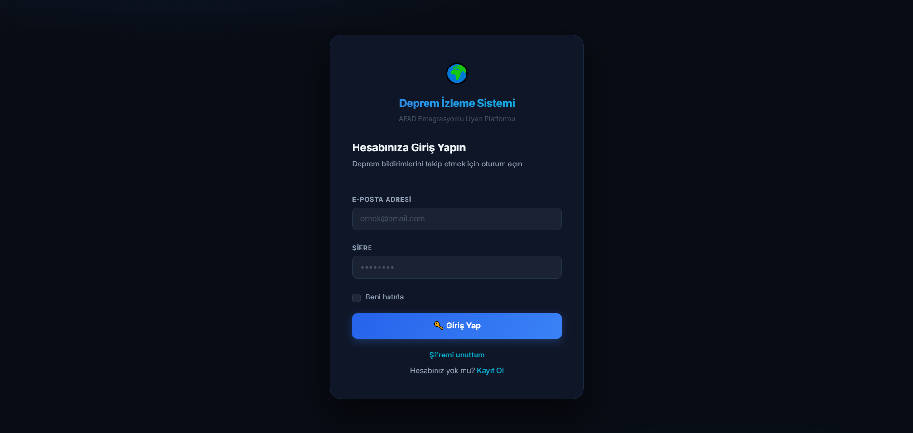
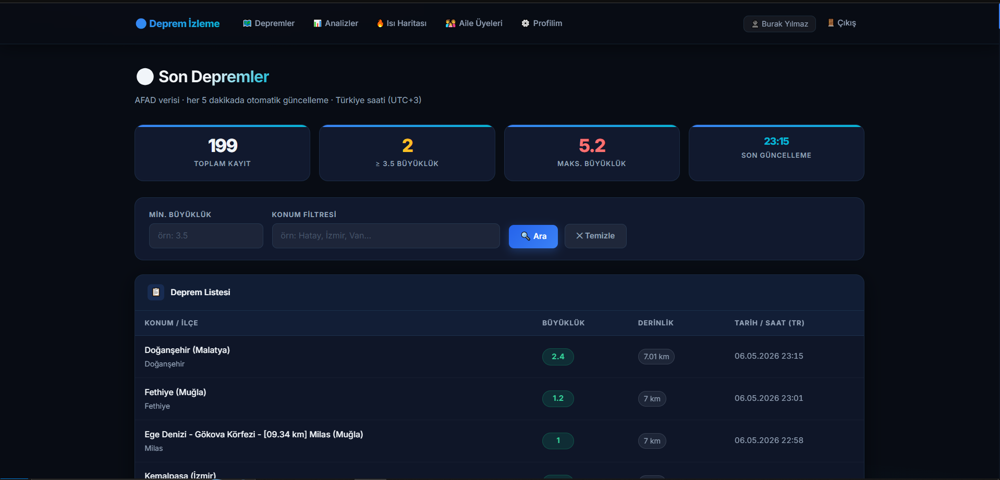
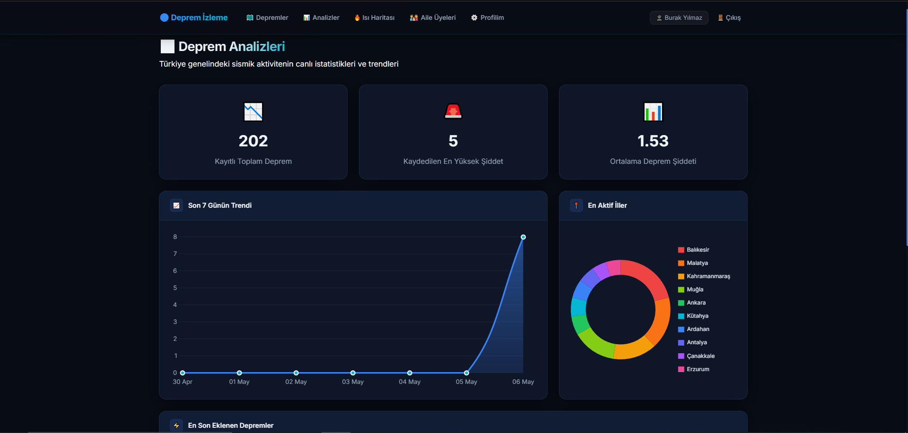
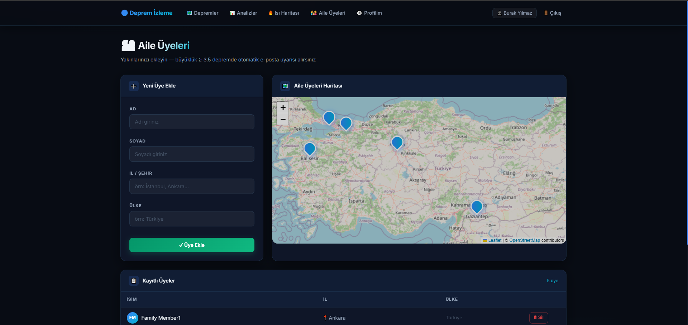
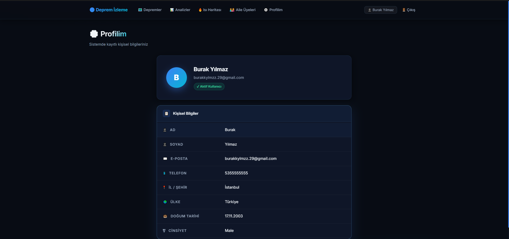

<div align="center">

# 🌍 Deprem İzleme Sistemi

**AFAD entegrasyonlu, gerçek zamanlı Türkiye deprem takip ve aile uyarı platformu**


</div>

---

## 📸 Ekran Görüntüleri

<div align="center">

### 🔑 Giriş Sayfası


### 📊 Deprem Listesi — İstatistik Kartlar & Filtreler


### 📈 Deprem Analizleri ve Trendler


### 👨‍👩‍👧 Aile Üyeleri & Harita


### 👤 Profil Sayfası


</div>

---

## 🚀 Özellikler

- 🗺️ **Gerçek Zamanlı Deprem Verisi** — AFAD API'den her 5 dakikada otomatik veri çekme
- ⏰ **Türkiye Saati (UTC+3)** — Tüm tarih/saat gösterimleri TR saatiyle
- 🔔 **Otomatik E-posta Uyarısı** — Büyüklük ≥ 3.5 depremde kayıtlı aile üyelerine bildirim
- 📍 **İnteraktif Harita** — Leaflet.js ile aile üyelerinin konumu
- 🎨 **Premium Dark UI** — Glassmorphism tasarım sistemi
- 🔐 **Kimlik Doğrulama** — ASP.NET Core Identity ile kullanıcı yönetimi
- 📨 **Kafka Mesaj Kuyruğu** — Deprem olayları event-driven mimaride işlenir
- 📅 **Arka Plan Görevleri** — Hangfire ile zamanlanmış AFAD senkronizasyonu

---

## 🏗️ Mimari

```
EarthquakeApi (Solution)
├── EarthquakeApi/              → ASP.NET Core MVC Web Uygulaması (UI + API)
├── EarthaquakeApplication/     → CQRS: Commands, Queries, Entities, Interfaces
└── EarthaquakeInfrastructure/  → AFAD Client, Kafka Producer/Consumer, E-posta
```

### Tech Stack

| Katman | Teknoloji |
|--------|-----------|
| Web Framework | ASP.NET Core 9 MVC |
| ORM | Entity Framework Core |
| Veritabanı | SQL Server 2022 |
| Mesaj Kuyruğu | Apache Kafka |
| Arka Plan İşler | Hangfire |
| Kimlik Doğrulama | ASP.NET Core Identity |
| Harita | Leaflet.js |
| Container | Docker & Docker Compose |
| UI | Bootstrap 5 + Custom Dark CSS |

---

## ⚙️ Kurulum

### Gereksinimler

- [Docker Desktop](https://www.docker.com/products/docker-desktop/) (v4+)
- Git

### 1. Projeyi Klonla

```bash
git clone https://github.com/BURAKK29/EarthquakeApi.git
cd EarthquakeApi
```

### 2. Yapılandırma Dosyalarını Oluştur

```bash
# Örnek dosyaları kopyala
cp appsettings.Example.json EarthquakeApi/appsettings.json
cp docker-compose.example.yml docker-compose.yml
cp .env.example .env
```

### 3. Gerçek Değerleri Gir

`.env` dosyasını düzenle:

```env
SA_PASSWORD=GüçlüBirŞifre123!
SMTP_USERNAME=your-email@gmail.com
SMTP_PASSWORD=gmail-app-password
```

`EarthquakeApi/appsettings.json` dosyasında e-posta ayarlarını güncelle:

```json
"EmailSettings": {
  "SenderEmail": "your-email@gmail.com",
  "Username": "your-email@gmail.com",
  "Password": "gmail-app-password"
}
```

> **💡 Gmail App Password:** Gmail → Güvenlik → 2 Adımlı Doğrulama → Uygulama Şifreleri

### 4. Çalıştır

```bash
docker compose up -d
```

İlk çalıştırmada Docker image'ları indirilir ve build edilir (~3-5 dakika).

### 5. Tarayıcıda Aç

| Servis | URL |
|--------|-----|
| 🌍 Web Uygulaması | http://localhost:8080 |
| 📊 Kafka UI | http://localhost:8081 |

---

## 🔧 Geliştirici Notları

### Container Durumu

```bash
docker compose ps
docker compose logs -f earthquakeapi
```

### Projeyi Durdurma

```bash
docker compose down        # containerları durdur
wsl --shutdown             # WSL2'yi kapat (RAM boşalt)
```

### RAM Yönetimi

WSL2 bellek kullanımını sınırlamak için `C:\Users\<kullanıcı>\.wslconfig`:

```ini
[wsl2]
memory=3GB
processors=2
swap=1GB
```

---

## 📁 Proje Yapısı

```
EarthquakeApi/
├── EarthquakeApi/
│   ├── Areas/Identity/         → ASP.NET Identity (Login, Register)
│   ├── Controller/             → MVC Controllers
│   ├── Views/                  → Razor Views (Dark Theme)
│   │   ├── EarthquakeList/
│   │   ├── FamilyMembers/
│   │   ├── Profile/
│   │   └── Shared/
│   └── wwwroot/
│       ├── css/site.css        → Premium Dark Design System
│       └── js/
│           ├── familyMapInitializer.js
│           └── turkeyCities.js
├── EarthaquakeApplication/
│   ├── Commands/               → CQRS Commands
│   ├── Queries/                → CQRS Queries
│   └── Entities/
├── EarthaquakeInfrastructure/
│   ├── Service/
│   │   ├── AfadClientService.cs   → AFAD API entegrasyonu
│   │   └── EarthquakeService.cs
│   ├── Kafka/                  → Producer & Consumer
│   └── Email/                  → SMTP E-posta servisi
├── docker-compose.example.yml
├── .env.example
└── .gitignore
```

---

## 📄 Lisans

MIT License — Detaylar için [LICENSE](LICENSE) dosyasına bakın.

---

<div align="center">
Made with ❤️ · <a href="https://github.com/BURAKK29">BURAKK29</a>
</div>
